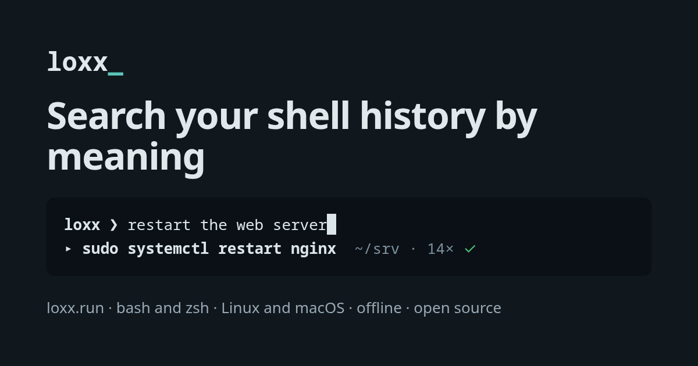

<p align="center"></p>

# loxx

Find any command you ran before, even if you only remember what it did.

Type `loxx`, then describe what you want, like "restart the web server" or
"undo my last commit". You can also type part of the command, like
"port-forward". Pick one, and it appears in your prompt, ready to use.

- **Private.** Everything stays on your computer. loxx never uses the internet.
- **Safe.** Passwords, API keys and tokens are removed before anything is saved.
- **Automatic.** It remembers every command you run, without slowing your terminal.

## Install

You need Linux with bash or zsh, or a Mac with zsh (the Mac default). Run:

```
curl -fsSL https://github.com/AniketR10/loxx/releases/latest/download/install.sh | sh
```

Then open a new terminal. That's it.

The installer checks that the download is genuine before installing, puts
loxx in `~/.local/bin`, adds one line to your shell settings, and loads your
old command history. It does not need `sudo`.

## Use

Type `loxx` and press Enter.

| Key | What it does |
|---|---|
| Type | Search. Exact matches show at once, matches by meaning a moment later. |
| ↑ ↓ | Move up and down the list. |
| Tab | Show only: commands from this folder, from this terminal, or ones that failed. |
| Enter | Use the command. In zsh it appears in your prompt. In bash, press ↑ once. |
| Esc | Close without choosing. |

loxx never runs a command by itself. You always press Enter to run it.

### Other commands

| Command | What it does |
|---|---|
| `loxx search <words>` | Print matching commands instead of opening the list. |
| `loxx status` | See how many commands are saved and whether loxx is working. |
| `loxx forget --last` | Delete the command you just ran, e.g. if you typed a password. |
| `loxx forget --match TEXT` | Delete every command that contains TEXT. |
| `loxx uninstall` | Remove loxx completely. |

## Your privacy

- loxx saves your commands only on your computer, in `~/.local/share/loxx`.
  Only you can read them.
- It never connects to the internet. Search works offline.
- It removes known secrets (API keys, tokens, passwords, private keys) before
  saving, and shows them as `<REDACTED:…>`.
- **Start a command with a space** and loxx will not save it at all.
- `loxx forget` deletes commands completely, including from the files on disk.

loxx can only remove secrets it recognizes. If you type an unusual secret,
start the command with a space, or run `loxx forget --last` afterwards.

## What loxx changes on your computer

| Where | What |
|---|---|
| `~/.local/bin/loxx` | The program (one file). |
| `~/.bashrc` and/or `~/.zshrc` | One marked block, added by the installer (see below). On a Mac, only `~/.zshrc`. |
| `~/.local/share/loxx/` | Your saved commands (`history.db`, an SQLite database). |
| `~/.local/state/loxx/` | A note that the installer put the program there, so uninstall can remove it. |

The block in your shell settings looks like this:

```
# >>> loxx >>>
[ -x '/home/you/.local/bin/loxx' ] && eval "$('/home/you/.local/bin/loxx' init bash)"
# <<< loxx <<<
```

`loxx uninstall` removes it and puts the file back exactly as it was. loxx
never changes your `PATH`.

## How it works

1. After every command, your shell starts `loxx record` in the background.
   It saves the command, the folder, the exit code and how long it took.
   Your prompt does not wait for it (it adds about 1–4 ms).
2. Before saving, loxx removes secrets it recognizes.
3. In the background, loxx turns each new command into numbers that capture its
   meaning, using a small language model built into the program
   ([all-MiniLM-L6-v2](https://huggingface.co/sentence-transformers/all-MiniLM-L6-v2)).
4. When you search, loxx combines two searches: exact words, and closest
   meaning. So both "port-forward" and "expose my service locally" work.

Everything is stored in one SQLite file. The search panel opens in about
30 ms, even with 100,000 saved commands.

## Settings

loxx has no settings file. These environment variables cover the rare cases:

| Variable | What it does |
|---|---|
| `LOXX_DB_PATH` | Save history to a different file. |
| `LOXX_BACKGROUND_EMBED=0` | Don't process new commands in the background (search by meaning then only covers commands processed by `loxx embed --pending`). |

To see the full list of commands: `loxx help`.

## If something seems wrong

Run `loxx status`. It shows:

- how many commands are saved, and when the last one was
- whether the hook is in your shell settings, and whether it is active in this
  terminal
- whether every command is ready for search by meaning

Common fixes:

- **Commands aren't being saved:** open a new terminal after installing. If
  `loxx status` says the hook is not in your settings, run `loxx setup`.
- **Search by meaning finds nothing new:** run `loxx embed --pending`.
- **bash:** put the loxx block at the end of `~/.bashrc`. Other tools that
  change `PROMPT_COMMAND` after it can stop it from working.

## Check a download is genuine

Every release file has a signed record of how it was built. With the GitHub
CLI:

```
gh attestation verify loxx-linux-amd64 --repo AniketR10/loxx
```

Use the name of the file you downloaded: `loxx-linux-amd64`, `loxx-linux-arm64`,
`loxx-darwin-arm64` (Mac with an Apple chip) or `loxx-darwin-amd64` (Intel Mac).

## Good to know

- Works on Linux with bash or zsh, and on macOS with zsh. Not on Windows.
- On a Mac, bash is not supported: the bash that comes with macOS is too old.
  zsh has been the Mac default since 2019.
- On a Mac, `~/.local/bin` is usually not in your `PATH`. Typing `loxx` still
  works in every new terminal, because the hook adds it. Anywhere else, use
  `~/.local/bin/loxx`.
- Your history stays on the computer where you ran the commands.
- When you search by meaning, loxx always shows the closest matches, even if
  none of them is a good match.
- loxx is about 54 MB, because the search model is built in.

## Uninstall

```
loxx uninstall
```

This removes loxx from your shell settings exactly as they were, asks whether
to delete your saved history, and deletes the program.

## Build it yourself

You need Go 1.25 or newer, `make` and `curl`:

```
git clone https://github.com/AniketR10/loxx
cd loxx
make build
bin/loxx setup
```

See [CONTRIBUTING.md](CONTRIBUTING.md) to help develop loxx.

## License

MIT. See [LICENSE](LICENSE). The built-in search model has its own license:
[internal/embed/model](internal/embed/model/).
